# Plan: Revamp content (Strapi CMS) deployment + IaC

## Confirmations

- ✅ The `content/` folder is a stock Strapi 5.29 app — all config files are boilerplate, `plugins.ts` is empty, content types and `types/generated` are auto-populated. The only hand-maintained surface is `package.json` dependencies.
- ✅ The `content/public/uploads` files are local test artifacts (gitignored) — **not** a modernization candidate. Excluded.
- ℹ️ The storage account + `sansk-cdn.azureedge.net` (classic, retiring) serve **static frontend assets** (the resume PDF), not Strapi media.
- ✅ **Shared Postgres, two roles**: server `sanskagarwal-db`, database `website`, schema `public`. Strapi (CMS) owns and migrates the tables (`blogs`, `notes`, Strapi internals) as `cms_user`; the frontend connects as a separate read-only user `web_user` (see `src/app/_dataprovider/RetryQuery.ts`). Phase 0 (✅ complete) converged this to a least-privilege allow-list model via `content/scripts/manage-db.mjs` — see below.
- ⚠️ **Security**: `src/.env` (with a live DB password) is present in the workspace. Confirm it is gitignored/untracked and rotate the password — track separately from this plan.

Deliver in phases so each part can be verified.

## Phase 0 — Database role & permission management script ✅ COMPLETE (applied to prod 2026-06-09)

Solves the user/permission pain, gives the admin full control without role-switching,
fixes a real security hole, and makes the model reproducible & inspectable.

### As-built (what was actually delivered)

- **Script: `content/scripts/manage-db.mjs`** (Node + `pg`, NOT bash/psql). Lives in
  `content/` because Strapi already depends on `pg`. Run via `cd content && npm run db -- <args>`.
  - Rewritten from an earlier bash version after Azure-specific psql edge cases
    (can't set `NOSUPERUSER`; grantor-dependency on REVOKE) made bash fragile.
  - **Transactional**: all critical changes run in one transaction (rolls back on
    failure — never half-applied). Risky cleanup steps each use their own savepoint,
    so a recoverable error degrades to a warning instead of aborting.
  - **Connection**: host/db/port/ssl default from `content/.env` (`DATABASE_*`). The
    admin login is NOT stored in the file — `PGUSER`/`PGPASSWORD` come from env vars
    or an interactive (hidden) prompt.
  - **Commands**: `status` (default, read-only report + drift) · `apply` (converge) ·
    `bootstrap` (converge on a fresh DB; Strapi still creates the tables itself).
  - **Flags**: `--read-tables "blogs notes"` (allow-list) · `--read-role` · `--cms-role`
    · `--web-role` · `--drop-role <name>` · `--dry-run`.

### Target model that was applied (verified zero drift)

- `cms_user` (LOGIN) — Strapi: owns all 39 tables; `USAGE`+`CREATE` on `public`.
- `app_readonly` (NOLOGIN group) — has `SELECT` on **only the allow-list** (`blogs`,
  `notes`). **No default privileges** — new tables stay unreadable by design until
  explicitly added via `--read-tables` and re-applied.
- `web_user` (LOGIN) — frontend: reads ONLY by inheriting `app_readonly`; holds **no
  direct grants**. `NOCREATEDB NOCREATEROLE`.
- `sanskar` (admin) — member of `cms_user` (manage/ALTER/DROP tables as yourself);
  removed from `web_user` and `app_readonly`.
- **Security fix**: the legacy `blogs` full-write grant on `web_user` was REVOKED
  (the frontend role could previously INSERT/UPDATE/DELETE/TRUNCATE blogs).
- **Cleanup**: the stray leftover Entra login role was dropped.
- Azure defaults (`public` owned by `azure_pg_admin`, `PUBLIC` usage) left untouched.

### Current DB state (after apply)

```mermaid
graph TD
    subgraph LOGIN["LOGIN roles"]
        sanskar["sanskar (admin)"]
        cms["cms_user (Strapi)"]
        web["web_user (frontend)"]
    end
    subgraph GROUP["GROUP roles (NOLOGIN)"]
        ro["app_readonly"]
        apg["azure_pg_admin"]
    end

    sanskar -->|member: manage tables as admin| cms
    sanskar -->|member: Azure admin| apg
    web -->|member: inherits SELECT| ro

    cms -->|OWNS + full DDL/DML| T[(all 39 tables)]
    ro -->|SELECT on ONLY blogs + notes| BN["blogs, notes"]
    web -.->|reads blogs+notes via group only| BN

    style web fill:#1b3a2b
    style ro fill:#1b2e4a
```

Verification (all clean): `npm run db` (status) shows no under-grant, no over-grant,
no direct `web_user` grants, and no default privileges. `apply` is idempotent.

### Operating it later

- Inspect: `cd content && npm run db` (status).
- Expose a new table to the frontend: `npm run db -- apply --read-tables "blogs notes recipes"`.
- Fresh server: `npm run db -- bootstrap` → start Strapi (creates tables) → `npm run db` (status).

### Follow-ups (not blocking)

- 🔴 **Rotate secrets**: the `sanskar` admin password was previously in `content/.env`
  and used on the terminal during testing; rotate `sanskar`, `web_user`, `cms_user`,
  and the Strapi `APP_KEYS`/JWT secrets. `content/.env` still holds live `cms_user`
  creds + Strapi secrets.
- 🟠 **Firewall**: server has an `AllowAll 0.0.0.0–255.255.255.255` rule — tighten later.
- ◻ Optional future hardening (deferred): dedicated `cms` schema, group-owner role.

## Phase 1 — Modernize the CMS pipeline (OIDC)

1. Rewrite `.github/workflows/content.yml` to call the reusable `.github/workflows/deploy-app.yml` with `package-path: content`, `app-name: sanskagarwal-cms`, `deploy-type: webapp`, `node-version: 22.x`, `secrets: inherit`, and `id-token: write` — matching `publish.yml`/`functions.yml`.
2. Drops the old `AZURE_CONTENTAPP_PUBLISH_PROFILE` flow (manual GH secret cleanup afterward).

## Phase 2 — Bring the CMS web app into IaC (depends on Phase 1 app name)

1. Generalize `infra/modules/webApp.bicep` — replace the hardcoded `keyVaultSecretSettings` (DATABASE_PASSWORD/TANDOOR_TOKEN) with a `keyVaultSecretRefs` array param so it serves both the frontend and the CMS; allow `NODE|22-lts`.
2. Add Strapi secrets to `infra/modules/keyVault.bicep`: `strapi-app-keys`, `strapi-api-token-salt`, `strapi-admin-jwt-secret`, `strapi-transfer-token-salt`, `strapi-jwt-secret`, plus `database-cms-password` (the `cms_user` password, distinct from the frontend's `database-password`).
3. In `infra/main.bicep`: add a `cmsApp` module (`sanskagarwal-cms`) on the existing `plan-sanskagarwal`, with `DATABASE_CLIENT=postgres` + reused `DATABASE_*` host/name/port settings, `DATABASE_USERNAME=cms_user`, the Strapi secret refs + `database-cms-password`, `cms.sanskagarwal.com` hostname, a Key Vault role assignment, and managed-cert + SNI entries (reusing existing modules).
4. Update `infra/main.bicepparam` + `.github/workflows/infra.yml` to pass the new `STRAPI_*` secrets via env vars.
5. Manual: DNS `CNAME cms → sanskagarwal-cms.azurewebsites.net`; create the `STRAPI_*` GitHub secrets.

## Phase 3 — Storage account + Azure Front Door (static assets) (independent of 1–2)

1. New storage-account module (separate from the Functions host storage) with a public `public` container for `/assets/`.
2. New `frontDoor.bicep` module: Front Door Standard profile + endpoint + origin group (blob origin) + route, using the **default Front Door endpoint hostname** (`<name>-<hash>.z01.azurefd.net`) — no custom domain / DNS work. Wire into `infra/main.bicep`/bicepparam.
3. Update `src/app/_utils/Constants.ts` `Resume_URI` default to the new Front Door default endpoint hostname.
4. Manual: migrate the resume PDF to the new storage; decommission the classic `sansk-cdn` (no DNS changes needed since we use the default FD hostname).

## Verification

1. Phase 0 ✅ — `npm run db -- apply` is idempotent (re-run = no-op); `npm run db`
   (status) reports zero drift; the admin (`sanskar`) can `ALTER`/`DROP` Strapi tables
   as itself; `web_user` reads only `blogs`+`notes` via `app_readonly`, with no direct
   grants. (Applied to prod 2026-06-09.)
2. Phase 1: `cd content && npm install && npm run build` passes; `Deploy CMS Backend` runs green via OIDC.
3. Phase 2: `az deployment group what-if` is clean; CMS admin reachable at `cms.sanskagarwal.com` over HTTPS.
4. Phase 3: resume PDF loads via the Front Door URL on the live frontend.

## Decisions

- Excluded: Strapi media/upload-provider work (local uploads are test data).
- CDN → Azure Front Door Standard using the **default endpoint hostname** (no custom domain).
- CMS reuses `plan-sanskagarwal` (P0v3) — capacity is fine; load is minimal.
- DB management is a Node script (`content/scripts/manage-db.mjs`, `npm run db`) run
  **locally** by the admin (not in CI). web_user is read-only on an explicit
  allow-list (`blogs`, `notes`); no default privileges — new tables are exposed
  deliberately by re-running `apply --read-tables`.

## Further considerations

- ✅ CMS database — same Postgres DB (`website`), separate users (`cms_user` / `web_user`); Phase 2 adds a `database-cms-password` secret.
- ✅ Front Door hostname — default endpoint hostname (uglier URL, no DNS work).
- ✅ Capacity — single P0v3 plan is sufficient; minimal load.
- ✅ DB management runs locally as a deliberate manual step against production (`npm run db`).
