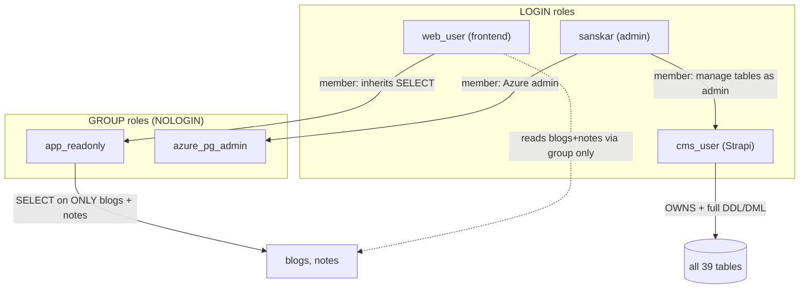

# Database role & permission model

Diagram of the target state that [`manage-db.mjs`](./manage-db.mjs) converges to
(applied to prod 2026-06-09). Regenerate/verify with `npm run db` (status).

## Roles

| Role | Type | Purpose |
| --- | --- | --- |
| `cms_user` | LOGIN | Strapi. Owns all tables; `USAGE`+`CREATE` on `public` (full DDL/DML). |
| `web_user` | LOGIN | Frontend. Reads ONLY by inheriting `app_readonly`; no direct grants; `NOCREATEDB NOCREATEROLE`. |
| `app_readonly` | NOLOGIN group | Has `SELECT` on the allow-list tables only (`blogs`, `notes`). |
| `sanskar` | LOGIN | Admin. Member of `cms_user` (manage/ALTER/DROP tables as self) + `azure_pg_admin`. |

## Key rules

- **Allow-list, not blanket access**: `app_readonly` gets `SELECT` on exactly the
  tables the frontend needs. **No default privileges** — new Strapi tables stay
  unreadable until added via `npm run db -- apply --read-tables "..."`.
- **Least privilege**: `web_user` holds no direct grants and cannot write anything.
- **Admin without role-switching**: `sanskar` manages every table via `cms_user`
  membership — no `SET ROLE`, no logging in as `cms_user`.
- Azure defaults (`public` owned by `azure_pg_admin`, `PUBLIC` usage) are untouched.
